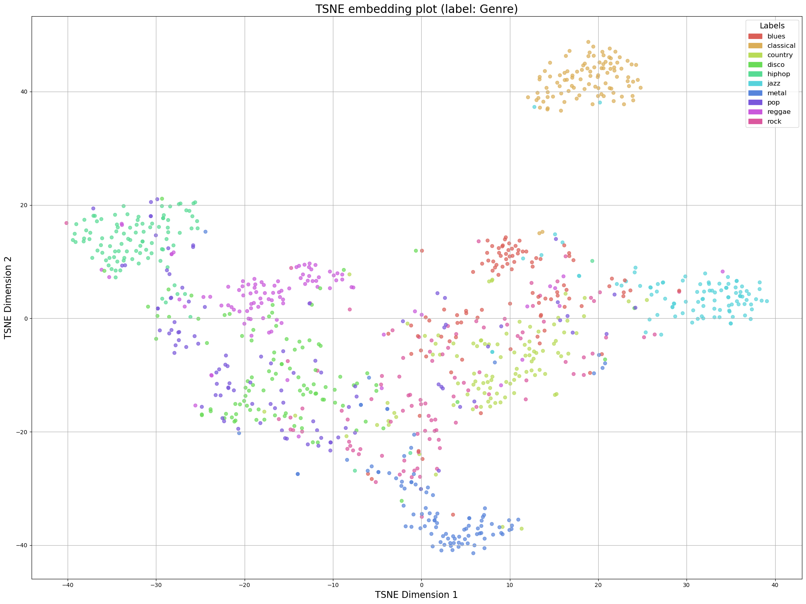
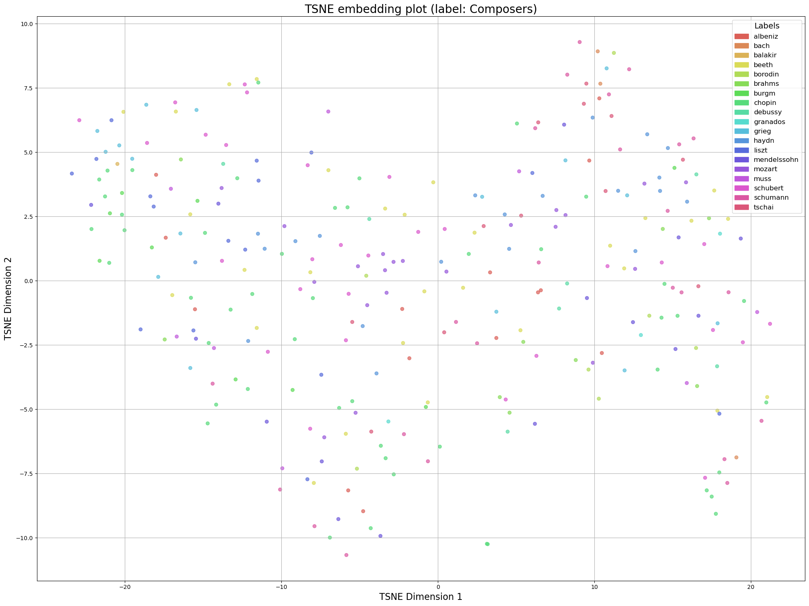

# Music_Cluster
음악 임베딩을 활용한 클러스터링 프로젝트

이 프로젝트는 다양한 음악 데이터를 임베딩 기법을 사용하여 클러스터링하는 방법을 소개합니다. 주로 t-SNE 알고리즘을 이용하여 고차원의 음악 데이터를 2차원 평면에 시각화하였으며, 이를 통해 다양한 음악 장르의 특성과 관계를 탐구합니다.

## 주요 내용

### t-SNE 시각화
-   
  각 장르는 특정 특징을 반영하여 군집화되었습니다. 예를 들어,  
  - **클래식:** 악기 소리의 독특한 특성으로 인하여 다른 장르와 명확한 차이를 보입니다.  
  - **락:** 재즈와 블루스에서 영향을 받아 다양한 음악 발전의 기초로 자리 잡아 여러 영역에 걸쳐 분포하고 있습니다.  
  - **힙합:** 빠른 템포와 즉각적인 가사 전달로 인해 한쪽으로 밀집되는 경향을 보입니다.

### 추가 시각화 자료
-   
  클래식 장르 내부에서도 각 작곡가의 개성 및 스타일이 뚜렷하게 나타납니다.
  
-   
  장르와 클래식 작곡가의 임베딩 결과를 함께 시각화했습니다.

## 프로젝트 목표
- 음악 데이터의 고차원 특징을 효과적으로 저차원으로 축소하여 시각화
- 다양한 음악 장르 간의 관계와 특성을 분석

## 사용된 기술 및 라이브러리
- t-SNE: 임베딩 및 데이터 차원 축소 알고리즘
- Python 및 관련 데이터 처리 라이브러리 (예: NumPy, scikit-learn 등)
- 시각화 도구 (예: matplotlib, seaborn 등)

---

이 프로젝트는 음악 데이터의 복잡한 특성을 보다 명확하게 이해하고, 다양한 음악 장르 간의 상호 관계를 탐구하기 위한 연구의 일환입니다.